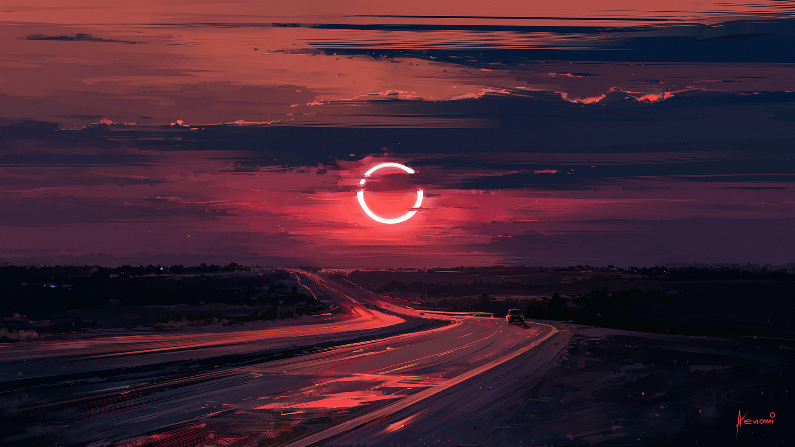

<h1 align='center' >My Wallpaper Collection </h1>

_My wallpaper collection. I use [feh](https://feh.finalrewind.org/) to set my wallpapers. I don't own any of these wallpapers. All credits go to the respective creators._

## Installation

Copy the following command and paste it in your terminal to download the wallpapers.

```bash
git clone https://github.com/atmozki/Walls.git
cd Walls
chmod +x install.sh
./install.sh
```

## Contributing 👨‍💻

If you know the source of any of the wallpapers, please let me know so I can give credit to the original creator.

## Credits 🧑‍🎨

- [Artstation](https://www.artstation.com/)
- [Anato Finnstark](https://www.artstation.com/anto-finnstark)
- [Aenami](https://www.artstation.com/aenamiart)
- [Unsplash](https://unsplash.com/)
- [Love Death Robots](https://www.netflix.com/title/80174608)
- [Wallhaven](https://wallhaven.cc/)
- [Batname](https://github.com/shajidhasan/batname)
- Others

## 📷 Preview

<p align='center' height='230px'>
<a></a>
<a></a>
<a></a>
<a></a>
<a></a>
<a></a>
</p>
